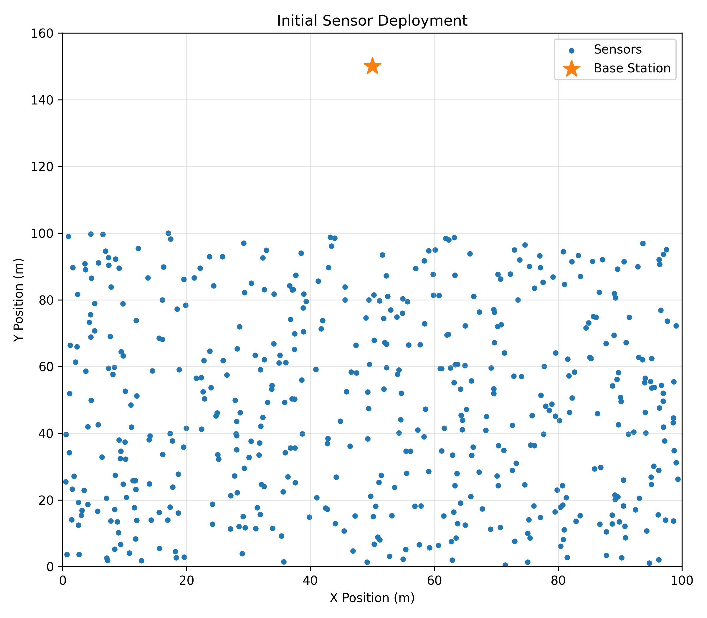
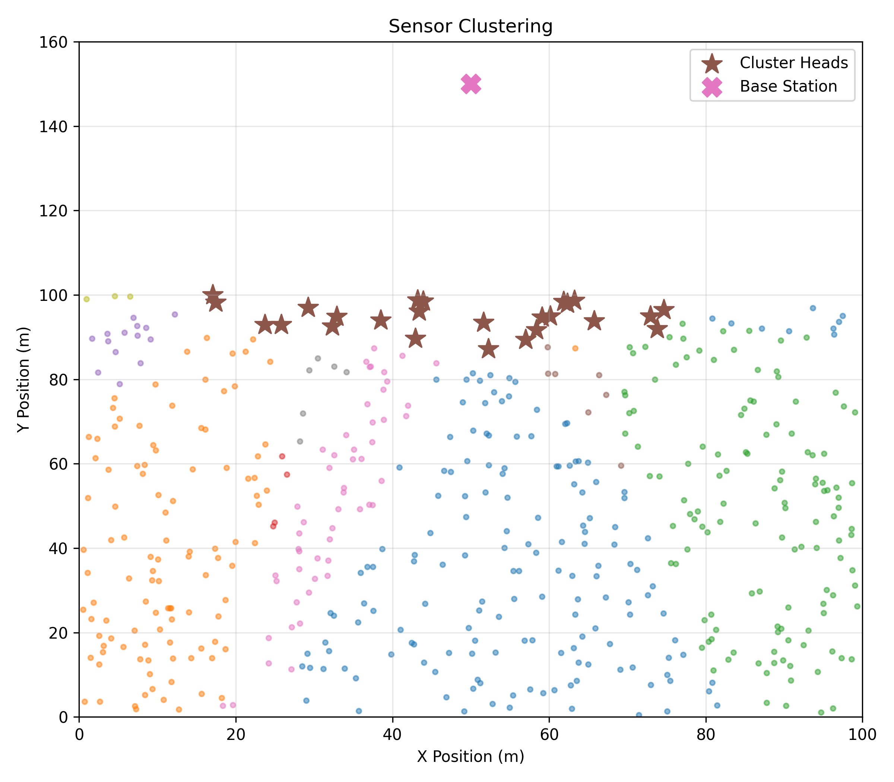
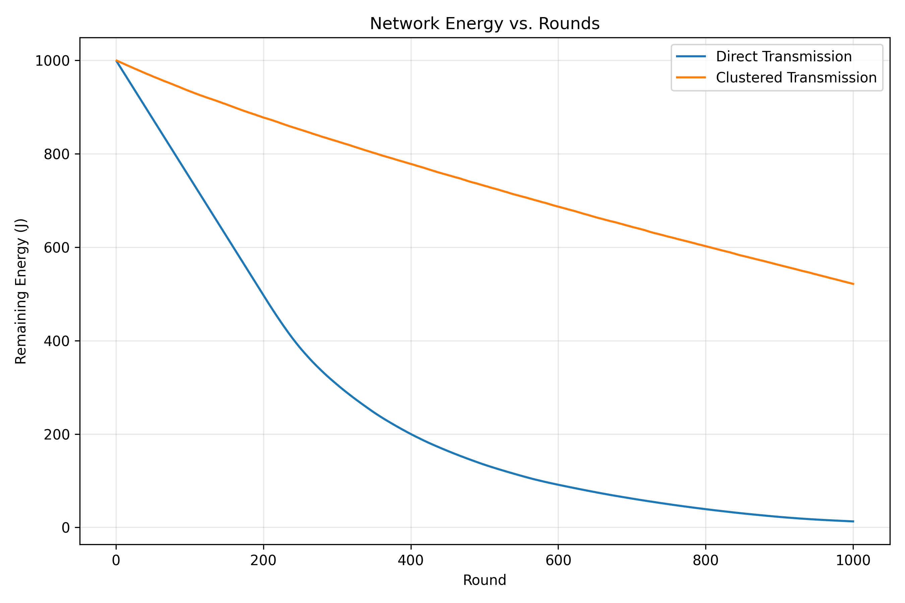
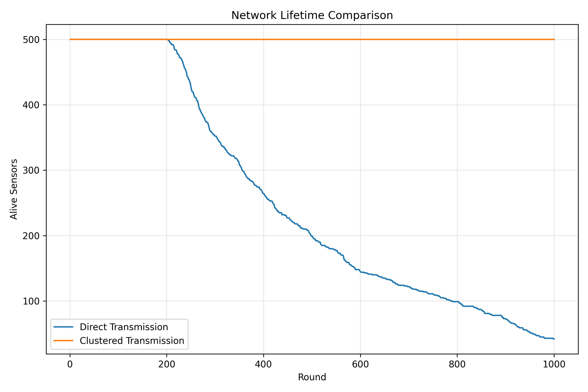

# 📡 Wireless Sensor Network Clustering Simulation

A reproducible Python simulation of a **500-node wireless sensor network (WSN)** that compares traditional direct transmission with energy-aware clustered communication.

The project models battery-powered sensors deployed over a 100 m × 100 m industrial area. Each sensor periodically transmits a 4,000-bit packet to a base station. The simulation measures remaining network energy, surviving sensors, cluster-head behavior, and **Time to First Node Death (TND)** over 1,000 communication rounds.

> **Core result:** Clustered communication distributes communication overhead across the network and substantially extends network lifetime compared with direct sensor-to-base-station transmission.

---

## ✨ Highlights

- 500 reproducibly generated sensor nodes.
- 100 m × 100 m deployment area.
- Base station positioned above the sensing field at `(50, 150)`.
- Direct-transmission baseline.
- Energy-aware and distance-aware cluster-head selection.
- Automatic cluster formation using nearest cluster-head assignment.
- Cluster-head rotation between rounds.
- First-node-death tracking through TND.
- Comparison of remaining energy and alive nodes over time.
- Cluster-count optimization for `k ∈ {5, 10, 15, 20, 25}`.
- Static round-by-round analysis website powered by Streamlit.
- Saved plots and optimization data in `results/`.

---

## 🧠 Project Objective

In direct transmission, every sensor sends its data directly to the base station. Sensors that are far from the base station pay a large distance-dependent transmission cost and therefore deplete their batteries quickly.

In clustered transmission:

1. Sensors are divided among cluster heads.
2. Ordinary sensors send short-range packets to their nearest cluster head.
3. Cluster heads receive and aggregate those packets.
4. Cluster heads send the aggregated information to the base station.
5. Cluster heads rotate between rounds to distribute the energy burden.

The goal is to reduce unnecessary long-distance transmissions and maximize network lifetime.

---

## 🗂️ Repository Structure

```text
Network_Cluster_sim/
├── app.py                         # Streamlit round-by-round analysis website
├── main.py                        # Batch simulation and plot generation entry point
├── optimize_k.py                  # Tests different numbers of clusters
├── requirements.txt               # Python dependencies
├── README.md                      # Project documentation
│
├── src/
│   ├── __init__.py                # Package marker
│   ├── config.py                  # Network, radio, and simulation parameters
│   ├── sensor.py                  # Sensor model and deterministic deployment
│   ├── energy.py                  # Radio-energy equations and battery updates
│   ├── clustering.py              # Cluster-head selection and cluster formation
│   ├── simulation.py              # Direct, clustered, and comparison simulations
│   ├── live_simulation.py         # One-round-at-a-time clustered simulation API
│   └── visualization.py           # Matplotlib charts saved to results/
│
└── results/
    ├── initial_deployment.png     # Initial sensor positions and base station
    ├── clustering.png             # Example cluster assignment
    ├── energy_comparison.png      # Remaining energy comparison
    ├── alive_nodes.png            # Network lifetime comparison
    └── k_optimization.csv         # Cluster-count experiment results
```

### Module responsibilities

| Module | Responsibility |
|---|---|
| `config.py` | Centralizes all experiment constants and radio-model parameters. |
| `sensor.py` | Creates sensors with positions, IDs, battery energy, and alive/dead state. |
| `energy.py` | Implements transmission, reception, aggregation, and battery-consumption logic. |
| `clustering.py` | Selects cluster heads and assigns alive sensors to their nearest head. |
| `simulation.py` | Runs communication rounds and returns energy, alive-node, TND, and cluster-head histories. |
| `live_simulation.py` | Exposes a stateful `step()` interface for advancing a simulation by one round. |
| `visualization.py` | Generates deployment, clustering, energy, and lifetime plots. |
| `main.py` | Runs the standard batch experiment and writes the figures in `results/`. |
| `optimize_k.py` | Evaluates several cluster counts and writes `results/k_optimization.csv`. |
| `app.py` | Presents the simulation interactively in a browser through Streamlit. |

---

## ⚙️ Simulation Configuration

The default experiment is defined in `src/config.py`:

| Parameter | Value | Meaning |
|---|---:|---|
| Number of sensors | `500` | Total sensor nodes |
| Deployment width | `100 m` | Horizontal sensing-field size |
| Deployment height | `100 m` | Vertical sensing-field size |
| Base station | `(50, 150)` | Base-station coordinates |
| Initial energy | `2.0 J` | Battery energy per sensor |
| Packet size | `4,000 bits` | Data packet generated per transmission |
| Simulation rounds | `1,000` | Communication rounds per experiment |
| Default cluster count | `25` | Number of cluster heads per round |
| Random seed | `42` | Makes node placement reproducible |
| Electronic energy | `50 nJ/bit` | Radio electronics cost |
| Amplifier energy | `100 pJ/bit/m²` | Distance-amplifier coefficient |
| Aggregation energy | `5 nJ/bit` | Data aggregation cost |

The fixed seed means that repeated runs use the same initial sensor deployment, making comparisons between direct and clustered transmission fair and reproducible.

---

## 📐 Mathematical Model

### 1. Euclidean distance

For two points `a = (x_a, y_a)` and `b = (x_b, y_b)`, the distance is:

$$
d(a,b) = \sqrt{(x_a-x_b)^2 + (y_a-y_b)^2}
$$

The implementation uses this for:

- Sensor-to-base-station distance.
- Sensor-to-cluster-head distance.
- Nearest-cluster assignment.

For a sensor `i` and base station `BS`:

$$
d_{i,BS} = \sqrt{(x_i-x_{BS})^2 + (y_i-y_{BS})^2}
$$

### 2. Transmission energy

The first-order radio model used by the project is:

$$
E_{TX}(L,d) = L\left(E_{elec} + E_{amp}d^2\right)
$$

where:

- `L` is the packet size in bits.
- `d` is the transmission distance in meters.
- `E_elec` is the electronic energy cost per bit.
- `E_amp` is the amplifier coefficient.

With the default configuration:

$$
E_{TX}(d) = 4000\left(50\times10^{-9} + 100\times10^{-12}d^2\right)\ \text{J}
$$

The quadratic distance term means long-range communication becomes increasingly expensive.

### 3. Reception energy

Receiving one packet costs:

$$
E_{RX}(L) = L E_{elec}
$$

For the default packet size:

$$
E_{RX} = 4000\times 50\times10^{-9}\ \text{J}
$$

### 4. Data aggregation energy

A cluster head spends energy aggregating each received packet:

$$
E_{DA}(L) = L E_{DA}
$$

For the default configuration:

$$
E_{DA} = 4000\times 5\times10^{-9}\ \text{J}
$$

### 5. Sensor battery update

After an energy expenditure `E_used`, a sensor's residual energy is updated as:

$$
E_i^{new} = \max\left(0, E_i^{old} - E_{used}\right)
$$

A sensor is marked dead when:

$$
E_i^{new} \leq 0
$$

Dead sensors do not participate in later communication rounds.

### 6. Direct-transmission round

In the direct baseline, every alive sensor sends directly to the base station:

$$
E_{round}^{direct} = \sum_{i\in A_t} E_{TX}(L,d_{i,BS})
$$

where `A_t` is the set of alive sensors at round `t`.

### 7. Clustered-transmission round

For each cluster head `h`, every alive non-head member `i` sends to `h`, and the head receives and aggregates that packet:

$$
E_{member\rightarrow head} = E_{TX}(L,d_{i,h}) + E_{RX}(L) + E_{DA}(L)
$$

The cluster head then transmits to the base station:

$$
E_{head\rightarrow BS} = E_{TX}(L,d_{h,BS})
$$

Therefore, a clustered round is modeled as:

$$
E_{round}^{clustered} =
\sum_{h}\sum_{i\in C_h,\ i\neq h}
\left[E_{TX}(L,d_{i,h}) + E_{RX}(L) + E_{DA}(L)\right]
+ \sum_h E_{TX}(L,d_{h,BS})
$$

where `C_h` is the cluster assigned to head `h`.

### 8. Cluster-head score

Candidate cluster heads are ranked using residual energy and distance to the base station:

$$
S_i = 0.7\left(\frac{E_i}{E_{max}}\right)
+ 0.3\left(1-\frac{d_{i,BS}}{d_{max}}\right)
$$

The `k` candidates with the highest scores are selected, subject to the rotation rule that previous-round heads are excluded when enough eligible sensors remain.

### 9. Cluster assignment

Each alive sensor is assigned to the closest selected cluster head:

$$
head(i) = \underset{h\in H}{\arg\min}\ d(i,h)
$$

where `H` is the selected set of cluster heads.

### 10. Time to First Node Death (TND)

TND is the first round in which the number of alive sensors becomes smaller than the initial sensor count:

$$
TND = \min\{t : Alive(t) < N\}
$$

If no sensor dies during the experiment, TND is reported as `None` or “Not reached.”

---

## 🚀 Installation

Python 3.9+ is recommended.

```bash
git clone https://github.com/sam27peter/Network_Cluster_sim.git
cd Network_Cluster_sim

python -m venv .venv

# macOS/Linux
source .venv/bin/activate

# Windows PowerShell
.venv\Scripts\Activate.ps1

pip install -r requirements.txt
```

---

## ▶️ Run the Batch Simulation

Run the standard direct-versus-clustered experiment:

```bash
python main.py
```

This command:

1. Creates the deterministic 500-sensor deployment.
2. Saves the initial deployment plot.
3. Builds and saves an example clustering plot.
4. Runs direct transmission for 1,000 rounds.
5. Runs clustered transmission using the default `k = 25`.
6. Saves energy and alive-node comparison plots.
7. Prints TND, final alive nodes, and final remaining energy in the terminal.

Generated files are written to `results/`.

---

## 📊 Optimize the Number of Clusters

Evaluate the configured cluster counts:

```bash
python optimize_k.py
```

The results are saved to:

```text
results/k_optimization.csv
```

The optimization script creates a fresh network for every tested value of `k`, which avoids carrying battery state from one experiment into another.

---

## 🌐 Launch the Static Round-by-Round Website

The repository includes a Streamlit dashboard in `app.py`. It builds simulation histories and lets you inspect the network at selected rounds.

Start it with:

```bash
streamlit run app.py
```

Streamlit will print a local URL, usually:

```text
http://localhost:8501
```

### Dashboard capabilities

- Select round `0`, `100`, `200`, …, `1000`.
- Compare direct and clustered transmission side by side.
- View alive sensors and remaining energy for the selected round.
- Display dead sensors and current cluster heads.
- Toggle cluster-head-to-base-station links.
- Inspect energy curves across all rounds.
- Inspect network-lifetime curves across all rounds.
- See the energy advantage and additional surviving sensors at the selected round.
- Reset and rebuild the simulation history.

Although the dashboard is called a “static website” in the project workflow, it is served locally by Streamlit and renders interactive, browser-based visualizations from the actual simulation model. It does not require a separate frontend framework or database.

---

## 📈 Included Results

The repository already contains the main generated figures:

### Initial deployment

The initial positions of all 500 sensors and the base station.



### Example clustering

The sensor field divided among the selected cluster heads.



### Remaining network energy

This chart compares total remaining battery energy over the simulation rounds.



### Network lifetime

This chart compares the number of alive sensors over time.



---

## 🧪 Recorded Benchmark Results

The committed benchmark in the repository uses 500 sensors, 1,000 rounds, the configured radio model, and the deterministic seed `42`.

### Direct vs clustered transmission

| Method | TND | Alive sensors at final recorded round | Final remaining energy |
|---|---:|---:|---:|
| Direct transmission | `203` | `42` | `12.95 J` |
| Clustered transmission (`k = 25`) | Not reached | `500` | `521.27 J` |

These values show the effect of avoiding 500 simultaneous long-distance transmissions to the base station. Under the tested configuration, clustered communication preserves the full sensor population through the recorded 1,000-round experiment, while direct transmission experiences its first node death at round 203.

### Cluster-count optimization

The checked values from `results/k_optimization.csv` are:

| Cluster count `k` | TND | Final alive sensors | Final remaining energy |
|---:|---:|---:|---:|
| 5 | 709 | 451 | 409.036490 J |
| 10 | 787 | 472 | 450.186146 J |
| 15 | 836 | 479 | 473.071967 J |
| 20 | 913 | 493 | 498.620176 J |
| 25 | Not reached | 500 | 521.268500 J |

For the tested range, `k = 25` produced the strongest recorded result: no node death during the experiment, the highest final number of alive nodes, and the highest final remaining energy. This is an empirical result for the current model and parameters, not a universal optimum for every WSN deployment.

---

## 🔁 Simulation Workflow

```text
Create deterministic sensor deployment
              │
              ▼
Initialize sensor batteries and alive states
              │
              ├── Direct mode
              │      └── Every alive sensor → Base Station
              │
              └── Clustered mode
                     ├── Select cluster heads
                     ├── Assign sensors to nearest head
                     ├── Sensor → Cluster Head
                     ├── Receive and aggregate packets
                     ├── Cluster Head → Base Station
                     └── Rotate heads for next round
              │
              ▼
Record energy, alive nodes, cluster heads, and TND
              │
              ▼
Generate plots, CSV results, and dashboard history
```

---

## 🧩 Reproducibility Notes

- Sensor coordinates are generated with NumPy using `RANDOM_SEED = 42`.
- Direct and clustered comparisons use separate fresh sensor populations with the same deterministic placement.
- The cluster optimizer creates a fresh deployment for each value of `k`.
- Results can change if you modify the number of sensors, initial energy, packet size, radio coefficients, base-station position, number of rounds, or random seed.

---

## 🛠️ Customization

Change the experiment by editing `src/config.py`:

```python
NUM_SENSORS = 500
AREA_WIDTH = 100
AREA_HEIGHT = 100
BS_X = 50
BS_Y = 150
INITIAL_ENERGY = 2.0
PACKET_SIZE = 4000
DEFAULT_CLUSTERS = 25
NUM_ROUNDS = 1000
RANDOM_SEED = 42
```

After changing parameters, rerun:

```bash
python main.py
python optimize_k.py
streamlit run app.py
```

---

## 📦 Dependencies

The project uses:

- **NumPy** for numerical operations and deterministic node generation.
- **Pandas** for data-analysis support.
- **Matplotlib** for saved visualizations.
- **SciPy** for scientific-computing support.
- **Streamlit** for the interactive browser dashboard.

Install all dependencies with:

```bash
pip install -r requirements.txt
```

---

## ⚠️ Modeling Scope

This is a simulation and educational/research prototype rather than a deployment-ready WSN protocol implementation. In particular:

- The radio model uses a simplified free-space `d²` amplifier term.
- Packet generation is represented by one fixed-size packet per communication event.
- The base station is assumed to have unlimited energy.
- Channel interference, collisions, retransmissions, bandwidth, latency, and packet loss are not modeled.
- Cluster heads aggregate received data using a fixed per-packet aggregation cost.
- The selected `k` is optimized only over the values tested by `optimize_k.py`.

These assumptions make the experiment easy to reproduce and interpret while leaving clear opportunities for future extensions.

---

## 🔮 Possible Extensions

- Add packet loss and retransmission models.
- Compare multiple radio propagation models, such as free-space and multipath fading.
- Add heterogeneous sensor batteries or energy harvesting.
- Track first-node, half-node, and last-node death separately.
- Add latency, throughput, and fairness metrics.
- Export full round histories to CSV or JSON.
- Add interactive controls for sensor count, packet size, and cluster count.
- Deploy the Streamlit dashboard publicly through Streamlit Community Cloud or another hosting service.

---

## 📄 License

No license file is currently included. Add a license before distributing the project for reuse in external projects.

---

## 👤 Author

Created by [sam27peter](https://github.com/sam27peter).

If this project helps your WSN, clustering, energy-modeling, or network-simulation work, consider ⭐ starring the repository and opening an issue with ideas or improvements.
